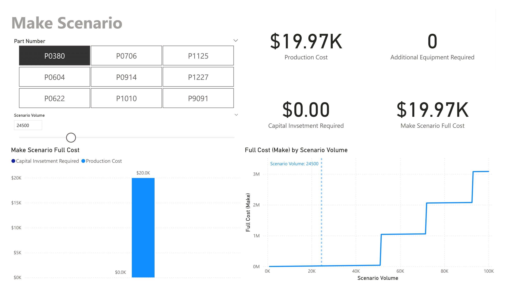

# Supply Chain Buy vs. Make Decision

## Overview
This Power BI project analyzes supply chain decisions, specifically comparing the costs and benefits of buying components from suppliers versus manufacturing them internally. The dashboard provides insights into supplier selection, cost comparisons, and scenario analysis for different production volumes.

## Data Sources
The project uses three main data sources:

**1. Quotes Table:** Contains supplier quotes for different parts and volumes.

| Column | Description |
|--------|-------------|
| Supplier | The name of the supplier providing the quote. |
| Part_Number | The identification number for the particular product or component being quoted. |
| Volume | The minimum volume that must be ordered for the particular quoted cost. |
| Quoted_Cost | The cost per unit that must be paid to the supplier for purchasing the goods. |
| Non_recurring_expenses | The one-time cost to enable production at the minimum volume quoted. |

**2. Internal Manufacturing Estimates Table:** Includes cost estimates for in-house production.

| Column | Description |
|--------|-------------|
| Machine_Model | The model of manufacturing equipment. |
| Part_Number | The identification number for the particular product or component whose cost is being estimated. |
| Cost_per_Unit | The marginal production costs associated with manufacturing another unit. This would include material cost, direct labor and variable overheads. |
| Unit_Capacity | The unit capacity is the number of units that the machine model can produce when it is fully used for the part number whose cost is being estimated. |
| Machine_Fixed_Cost | The one-time cost of acquiring another machine for manufacturing. |
| Existing_Capacity | The available capacity of the current machinery in the company. |
| Machine_Fixed_Overhead_Rate | The cost of owning and operating the manufacturing equipment that does not scale with changes in production volume. |

**3. Product Dimensions:** Provides information about the parts and associated projects.

| Column | Description |
|--------|-------------|
| Part_Number | The identification number for the particular product or component. |
| Part_Name | The name of the product or component. |
| Project | The name of the project that the product or component is associated with. |

## Report Structure and Key Visualizations
The Power BI report consists of several pages:

### 1. Supplier Selection

This page is your starting point for supplier analysis. Use the slicer to focus on a specific part, then examine the Average Unit Cost and Non Recurring Expenses charts to identify cost-effective suppliers. Pay attention to how costs change with volume – look for crossover points where one supplier becomes more economical than another. The Lowest Cost Suppliers chart quickly highlights the best options.

Key insights: Identify which suppliers are most cost-effective for different volume ranges and parts. Understand how volume affects pricing structures across suppliers.

### 2. Buy Scenario

Here, you'll dive deep into the costs of purchasing from suppliers. Use the volume slicer to see how total costs scale at different production levels. The Full Cost by Supplier chart breaks down costs, helping you understand each supplier's pricing structure. Pay close attention to the Full Cost by Scenario Volume chart – the slopes of these lines reveal which suppliers become more or less competitive as volume increases.

Key insights: Determine the most cost-effective supplier for your specific volume needs. Identify volume thresholds where certain suppliers become more economical, and understand the balance between non-recurring expenses and per-unit costs.

### 3. Make Scenario

This page examines internal manufacturing costs. Focus on how the Make Scenario Full Cost breaks down between capital investment and production costs at different volumes. The step chart showing Full Cost by Scenario Volume is crucial – it reveals the production volumes where significant cost changes occur, indicating capacity thresholds.

Key insights: Understand at what production volumes internal manufacturing becomes more economical. Identify the optimal production levels that balance capital investment with operational costs. Use this information to plan capacity expansion or utilization.

### 4. Make vs Buy Comparison

This is your decision-making hub. Use the volume slicer to find the breakeven point where making becomes more cost-effective than buying, or vice versa. The Cost Avoidance metric quantifies potential savings from choosing the optimal strategy. Examine how the make-vs-buy recommendation changes across different parts and volumes.

Key insights: Make data-driven decisions on whether to manufacture internally or purchase from suppliers for each part and volume scenario. Quantify the financial impact of these decisions and identify patterns in which scenario is favored for different types of parts or volume ranges.

## DAX Measures
The project uses several DAX measures to calculate key metrics:

### Buy Scenario
- Scenario Non Recurring Expenses: One-time costs associated with setting up production or initiating a supplier relationship.
- Scenario Extended Cost: The total cost of purchasing from suppliers excluding non-recurring expenses.
- Lowest Cost Supplier: Identifies the supplier offering the lowest total cost for a given part and volume.
- Buy Scenario Full Cost: Total cost of purchasing from suppliers, including non-recurring expenses and per-unit costs.

### Make Scenario
- Capital Investment Required: The upfront cost needed to begin or expand internal manufacturing capabilities.
- Production Cost: The variable cost associated with manufacturing parts internally.
- Make Scenario Full Cost: Total cost of internal manufacturing, including capital investment and production costs.

### Make vs Buy
- Make vs Buy: A logic-based measure that recommends whether to make or buy based on cost comparison.
- Cost Avoidance: The difference between the higher-cost option and the lower-cost option, representing potential savings.

## How to Use
1. Open the Power BI file in Power BI Desktop.
2. Use the slicers on each page to filter by Part Number and Scenario Volume.
3. Interact with the visualizations to gain insights into costs and supplier comparisons.

## Insights and Decision-Making
- The dashboard allows users to compare costs between buying from suppliers and manufacturing in-house at different volumes.
- Users can identify the lowest-cost suppliers for each part and volume scenario.
- The Make vs Buy page provides a clear recommendation on whether to make or buy based on cost comparisons.
- Cost avoidance calculations show potential savings from choosing the optimal strategy.
